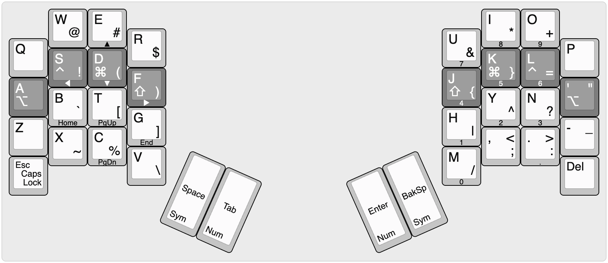

# Phalanx 36: A Layout for the Kinesis Advantage360 Pro

Reaching for keys sideways has always been difficult for my inflexible, stubby fingers. If that sounds familiar, then Phalanx was designed for you! Its core principle is to eliminate all lateral finger movement.

Table of Contents

- [Motivation](#motivation)
- [Design Philosophy](#design-philosophy)
- [Features](#features)
- [Getting Started](#getting-started)
- [Known Issues](#known-issues)
- [Credits](#credits)

## Motivation

My journey into split ergonomic keyboards began with the Advantage360 Pro. The switch was revelatory, but it also surfaced a painful truth. And I mean **pain** in the physical sense.

As I disciplined myself to type with proper form - wrists stationary - I found that reaching sideways caused strain in my index and pinky fingers.

Phalanx grew out of my effort to eliminate that pain. By restricting each finger to its most natural forward-and-back motion and offloading work to the thumbs, this layout creates a typing experience that is finally comfortable for my hands. I'm sharing it in the hope that it can do the same for you.

## Design Philosophy

Phalanx is more than just a keymap; it's a specific approach to minimalist ergonomic design born from a critical look at existing tradeoffs in the space.

### The Problem: Lateral Movement

Many popular minimalist layouts use a 3x5 or 3x6 finger matrix (3 rows and 5 or 6 columns per hand). To fit all 26 Latin characters on the base layer, such designs require at least one finger - typically the index or pinky - to be responsible for more than one column. This necessitates the very lateral (sideways) finger movement that can cause strain.

### The Solution: A New Tradeoff

Phalanx starts with a single, uncompromising constraint: zero lateral movement. This is achieved by assigning each finger to exactly one column, resulting in a strict 4-column-per-hand layout.

A 4-column layout with only 3 rows (i.e. a 3x4 finger matrix) would provide only 24 keys for the fingers, which is not enough to place all letters on the base layer, let alone punctuation. To work around that limitation, Phalanx adds a fourth row, creating a 4x4 finger matrix on each hand. With 32 total finger keys, it has ample space for all 26 letters and common punctuation on the base layer, with no side-reaching required.

This is the core tradeoff that Phalanx represents: accept increased vertical finger travel to completely eliminate all lateral movement.

Consistent with its minimalist philosophy, Phalanx does not have a dedicated number row. All numbers and additional symbols are placed on separate layers, accessible via the thumbs.

Ultimately, Phalanx is an experiment to test the hypothesis that natural up-and-down finger curling is more comfortable and sustainable than lateral stretching.

## Features

0. **Zero Lateral Finger Movement**: To enforce strict columnar movement (true to the Phalanx name), each finger is assigned exactly one column.

1. **QWERTY Number One**: To reduce cognitive load for the most common migration path, the default keymap minimizes deviations from standard QWERTY letter positions. While the default is QWERTY-based, other keymaps like Dvorak or Colemak are easily adapted to the columnar philosophy.

2. **Two Thumbs Strong**: To maximize utility of the strongest digits, the two keys under each thumb are dual-purpose: they perform direct inputs (`Space`, `Backspace`, etc.) when tapped and switch layers when held.

3. **Three Layers Is a Charm**: To make all layers easily accessible via the thumb keys, the entire keymap is organized into only three layers: a base layer for alphas, a symbol layer, and a navigation/numpad layer.

4. **A Home for All Four Modifiers**: To centralize control and eliminate dedicated modifier keys, all home-row keys are also dual-purpose: they perform as standard letter keys when tapped and act as modifiers (`Shift`, `Cmd`, `Ctrl`, `Option`) when held. `CapsLock` is toggled by double-tapping `Escape`.

## Getting Started

There are two ways to use Phalanx: flashing a pre-built firmware or customizing it to make it your own.

### Option A: Flash the Pre-Built Firmware

This is the quickest way to try Phalanx.

1. Download the latest `firmware.zip` file from the [Releases](https://github.com/mkovaxx/phalanx36-for-Adv360-Pro/releases) page.
2. Unzip the archive to get the `left.uf2` and `right.uf2` files.
3. Proceed with the flashing instructions below.

### Option B: Customize and Build Your Own

If you want to tweak the keymap, you can easily build your own version.

1. Fork this repo.
2. Enable GitHub Actions on your fork.
3. Open your fork in [Keymap Editor](https://nickcoutsos.github.io/keymap-editor).
4. Edit the keymap.
5. Click `Save` to commit your changes and trigger a build.
6. Follow the link on the right side of the `Save` button to the build run page.
7. On the build page, scroll down to the **Artifacts** section, and download the `firmware.zip` file.
2. Unzip the archive to get the `left.uf2` and `right.uf2` files.
8. Proceed with the flashing instructions below.

### Flashing Instructions

Once you have the `left.uf2` and `right.uf2` files, follow the steps on page 2 of the [Firmware Update Instructions](https://kinesis-ergo.com/wp-content/uploads/Advantage360-Professional-Firmware-Update-Instructions-9.5.24-KB360-PRO.pdf).

1. Power off both halves of the Adv360 Pro.
2. Connect the **left** half to your computer via USB.
3. Double-tap its bootloader button with a paper clip. It will appear as a USB drive named `ADV360PRO`.
4. Copy the `left.uf2` file onto that drive. It will automatically flash and dismount.
5. Disconnect the **left** half, and leave it powered off.
6. Connect the **right** half to your computer via USB.
7. Double-tap its bootloader button with a paper clip. It will appear as a USB drive named `ADV360PRO`.
8. Copy the `right.uf2` file onto that drive. It will automatically flash and dismount.
9. Disconnect the **right** half, and leave it powered off.
10. Power on first the **left**, then the **right** half.
11. Enjoy!

> **Bootloader Button**: There are also physical reset buttons on both keyboards which can be used to enter and exit the bootloader mode. Their location is described on page 2 in the [Firmware Update Instructions](https://kinesis-ergo.com/wp-content/uploads/Advantage360-Professional-Firmware-Update-Instructions-9.5.24-KB360-PRO.pdf).

> **Note**: Some operating systems wont always treat the drive as ejected after the settings-reset file is flashed or may throw a spurious error, this doesn't mean that the flashing process has failed.

## Known Issues

### Battery Reporting

By default, reporting the battery level over BLE is disabled, as this can cause some computers to spontaneously wake up repeatedly. If you'd like to enable this functionality change `CONFIG_BT_BAS=n` to  `CONFIG_BT_BAS=y` in [adv360_left_defconfig](/config/boards/arm/adv360/adv360_left_defconfig#L58).

## Credits

Phalanx stands on the shoulders of the following giants:

- [Advantage360 Pro by Kinesis](https://kinesis-ergo.com/shop/adv360pro): Inspired this layout and is the primary target for its implementation.
- [ZMK Firmware](https://github.com/zmkfirmware/zmk): Enables re-programming the Adv360 and supporting complex behaviors such as hold/tap.
- [Keymap Editor by nickcoutsos](https://github.com/nickcoutsos/keymap-editor): Helps edit ZMK keymap configurations. No need to understand ZMK internals or even programming.
- [Keyboard Layout Editor by ijprest](https://github.com/ijprest/keyboard-layout-editor): Helps visualize keyboard layouts and keymaps in a compact way.
